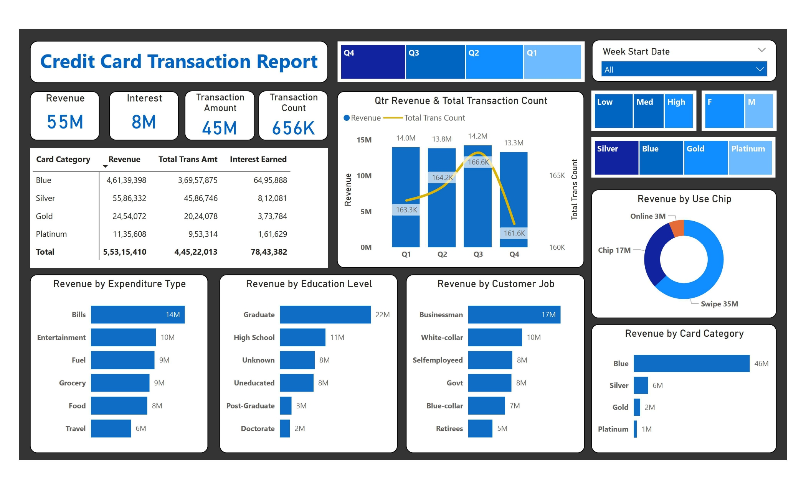
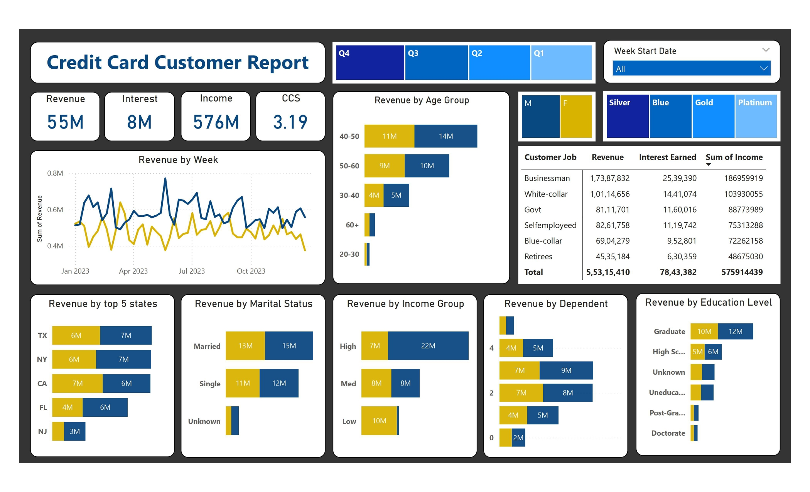

# Customer Spending & Revenue Analytics

## Project Overview

A Power BI analytics project focused on understanding credit card revenue, transaction activity, and customer spending behavior.

The project analyzes transaction and customer-level data to identify revenue trends, customer segments, spending patterns, and key performance indicators.

## Objective

To build an interactive dashboard that enables analysis of credit card performance across revenue, transactions, customer demographics, expenditure categories, occupations, education, income, and payment methods.

## Tools & Technologies

- Power BI
- DAX
- Data Modeling
- Data Transformation
- Data Visualization

## Key Analysis Areas

- Revenue performance
- Weekly revenue trends
- Week-over-week revenue growth
- Transaction activity
- Card category performance
- Expenditure categories
- Customer demographics
- Age segmentation
- Income segmentation
- Occupation and education analysis
- Payment method analysis

## Dashboard

### Credit Card Transaction Report

### Credit Card Customer Report

## Key Insights

- Blue card category generated the highest revenue among the displayed card categories.
- Bills represented the largest expenditure category.
- Businessmen generated the highest revenue among the displayed occupation groups.
- Graduates generated the highest revenue among the displayed education groups.
- Swipe transactions represented the largest transaction method in the dashboard.

## DAX Analysis

DAX was used to create revenue calculations, weekly revenue measures, week-over-week revenue growth, and customer segmentation.

[View DAX Measures & Calculated Columns](dax-measures.md)

